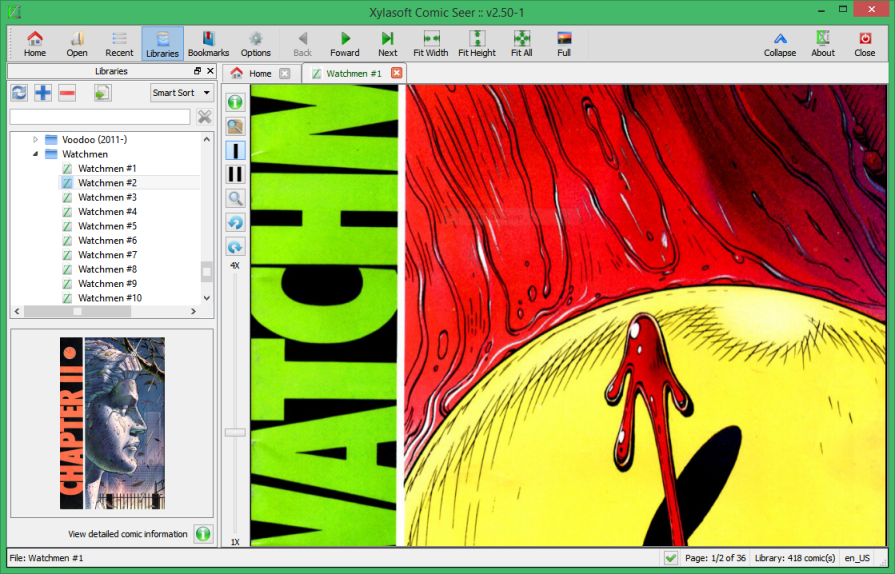
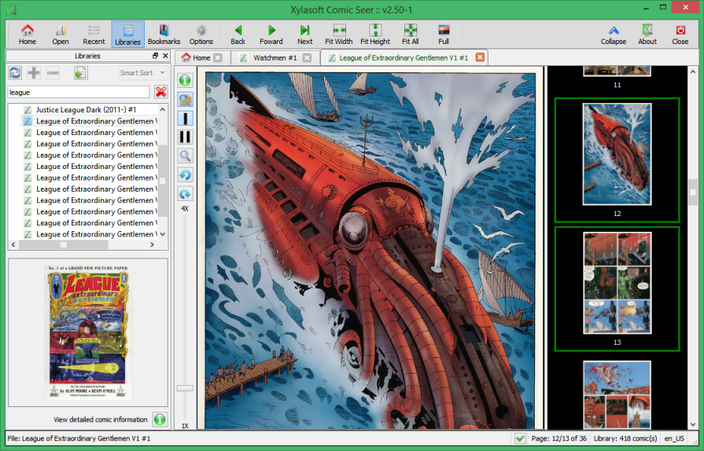
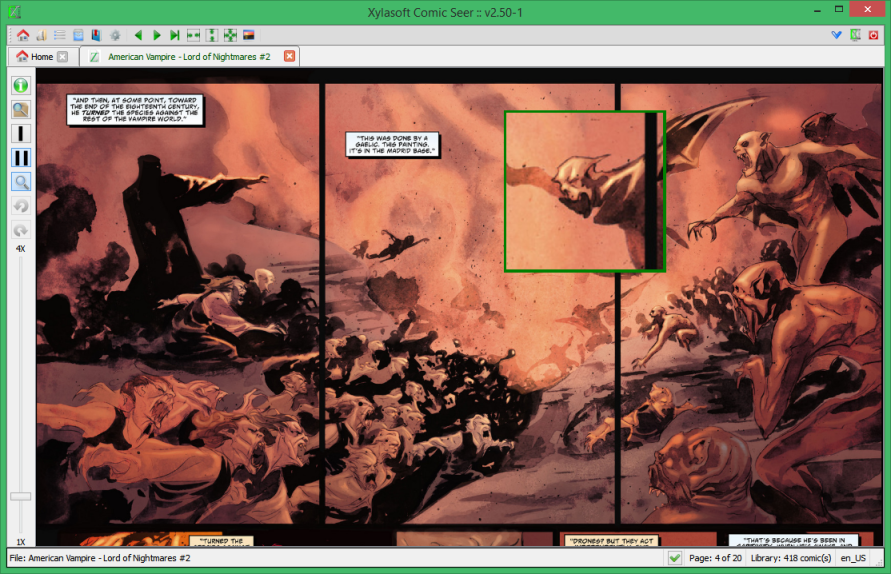
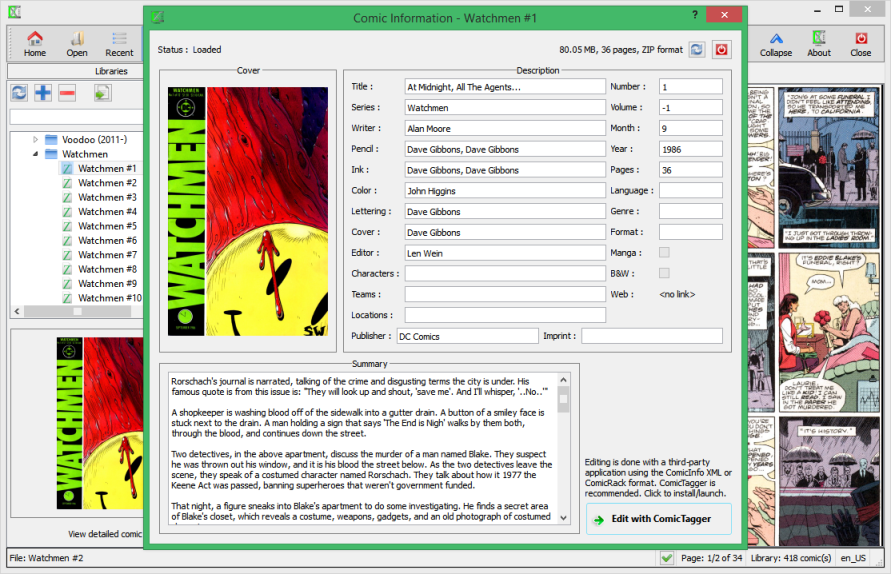
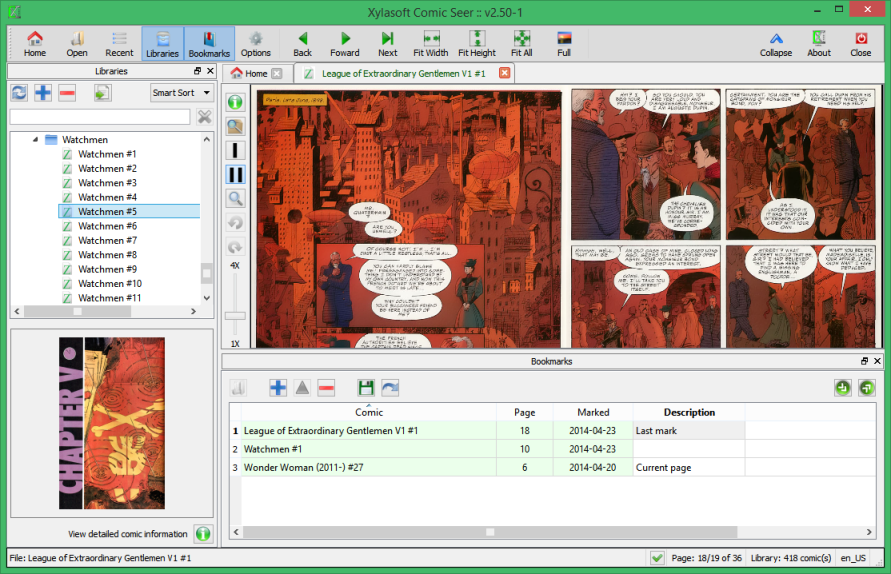

# ComicSeer Desktop

Comic Seer for the Windows and Linux desktop is one of the most popular comic reading applications. It is freely available and used by hundreds of people daily. The key features include:
- Single and dual page viewing
- Zoom from 1X to 4X
- 90 degree page rotations
- Comic page browsing
- Library management
- Bookmarking
- Comic meta-data integration

It is built using the cross platform Qt framework.

### Relation to Comic Seer App
ComicSeer Desktop is different than the [Comic Seeer App](https://www.microsoft.com/en-us/p/comic-seer/9wzdncrdkcqp?rtc=1&activetab=pivot:overviewtab), which is available only on Windows and not open source. The app is modern option for Comic Seer, but is very Windows-specific (desktop & mobile), so it will not be released on other platforms.

# Screenshots

# Multi-language Support

Comic Seer can be adapted to other languages. The below languages are currently supported (outside of English) and always open to new contributions!

Language files are not guaranteed to be compatible across versions. If you upgrade Comic Seer and are using a language file, please use the latest language file as well.

| Language | File | Completion | Contributor |
| -------- | ---- | ---------- | ----------- |
| Czech/Czech Republic | comicseer_cs_CZ | 100.0% | pavelfric@seznam.cz |
| French/France | comicseer_fr_FR | 100.0% | chezdom@yahoo.fr |
| Greek/Greece | comicseer_el_GR | 100.0% | admin@geogeo.gr |
| Russian/Russia | comicseer_ru_RU | 86.5% | alexxx4212@yandex.com |

For details on building/installing language files, refer to [TRANSLATIONS](TRANSLATIONS.md).

# Binary Downloads

You can download the latest releases from [Releases](https://github.com/xylamic/comicseer-desktop/releases).

# Licensing

Comic Seer Desktop is free to download and distribute. Contribution via this repo is preferred, but forking is also allowed. If you want to contribute to this repo, send a message to [comicseer@xylasoft.com](mailto:comicseer@xylasoft.com) and will provide you the access & details.

# Development

The development environment for Comic Seer Desktop is Qt & Qt Creator. The details on how to setup the environment for Windows & Linux is at [doc/Environment](doc/Environment). A more natural experience will be added and integrated into GitHub, but until then, manual steps are required.

# FAQ

Does this work on Mac?
- The Qt framework is compatible with Mac and the code can be tweaked to work on Mac with minimal effort, but it has not been completed as yet.

