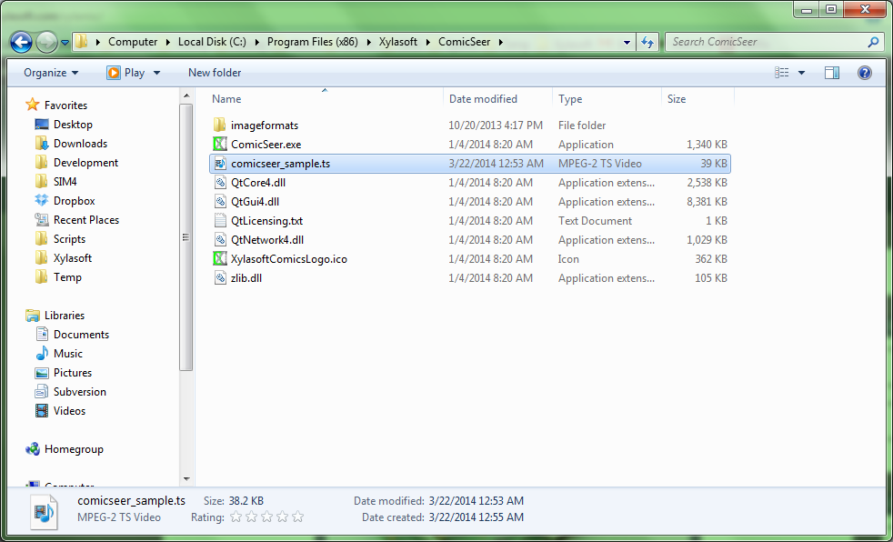
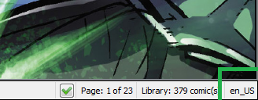
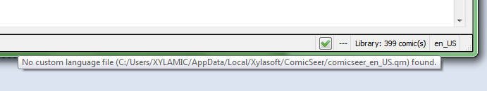
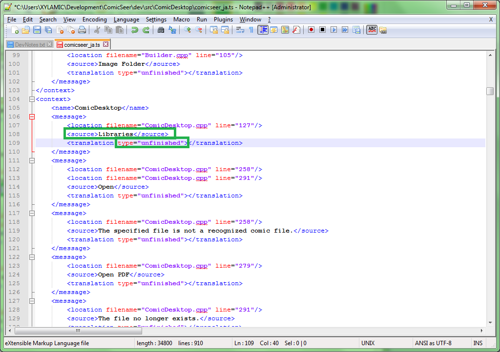
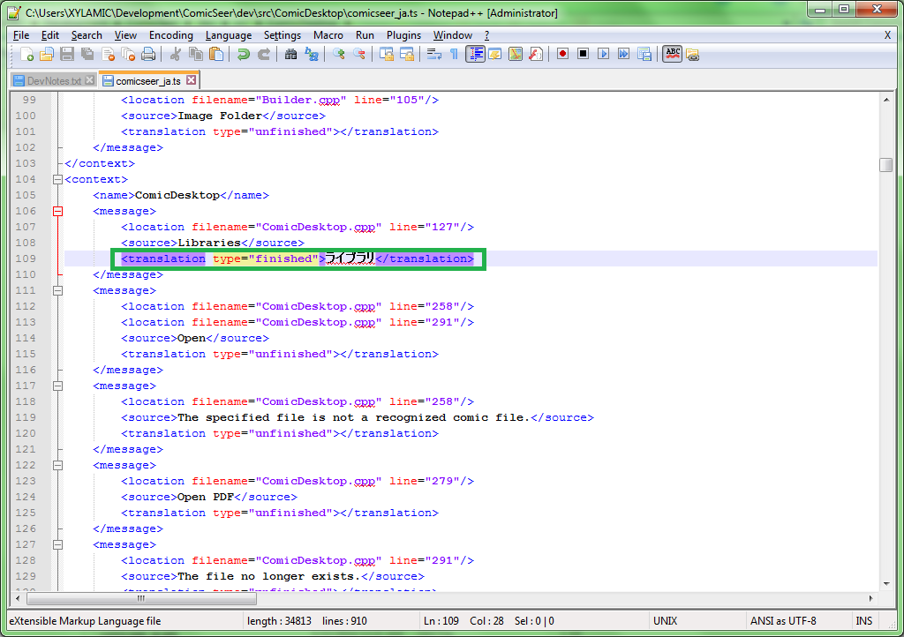
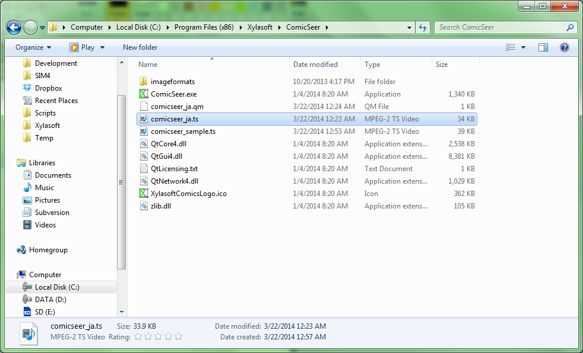
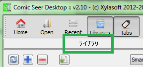

# Overview
Starting with Comic Seer v2.21, one of the new features available is localization. More specifically, Comic Seer now allows the changing of the language for all of the text in the application from English to something else. Only English will be distributed with Comic Seer, but anyone can create their own language files for their native language. If you create a language file, you can send it to [comicseer@xylasoft.com](mailto:comicseer@xylasoft.com) to be uploaded to the main site for others. This article explains the process of creating and using a language file. You don’t need to be a programmer to create a language file and the only tool you need is a text editor (eg: Notepad). If you are only interested in using a language file that has already been created, you can skip to the last section.

# Creating a translation
The first step is locating the sample translation file. This will be installed with Comic Seer or you can download it from the Comic Seer website. The install location defaults to “<ProgramFiles>/Xylasoft/ComicSeer” on Windows and “/usr/share/doc/comicseer” on Linux. 



Once you’ve located the file, make a copy of it and change the file from “comicseer_sample.ts” to “comicseer_<language_abbr>.ts” where the language abbreviation can be found by looking it up ([this is a good reference](http://pic.dhe.ibm.com/infocenter/zvm/v6r2/index.jsp?topic=%2Fcom.ibm.zos.r12.cbcpx01%2Flocnamc.htm)) or when you open the application, you can see the abbreviation in the lower right.



If you hold your mouse over the indicator in the lower right, the tooltip will display the status of the custom language and the full file name it is expecting for later reference.

 

Once you have your file, you can open it open in any text editor, such as Notepad or [Notepad++](http://notepad-plus-plus.org/download/) on Windows, and gEdit or nano on Linux. This file will have a list of all text that can be translated. For each entry, you will see the currently displayed text (don’t edit this) and a place for the translation to be entered. If your text editor provides an encoding option, UTF-8 should be used.

 

You can then add your new language text between the “translation” elements. You also have to change “unfinished” to “finished.” If you do not change the type to finished, it will not be included in the translation generation. It is not required to change all of the text in the file. If you do not add a translation, the original English text will be displayed.



Once you have changed all of the text desired, there are two options.
- Recommended: You can download the [Qt libraries](http://qt-project.org/downloads) on Windows or install “qt4-linguist-tools” on Linux. These tools can be used compile your own language and try it out.
  - On Ubuntu, you can run from the terminal “sudo apt-get install qt4-linguist-tools”
- Alternative for non-technical: You can send the file (.ts) to comicseer@xylasoft.com with your name. I will compile it and send the resulting file (.qm) back to you.

If you want to skip compiling your own translation, move to the last section.

## Compiling a translation

When you have downloaded and installed the Qt libraries, there is a executable call “lrelease” which will compile your text language file (.ts) into a compiled language file (.qm). If on Windows, you will need to locate where this file was installed. By default, it will be installed to “C:\Qt\<version>\bin.” This is typically not required for Linux.

Open up a command prompt (Windows) or terminal (Linux). You need to traverse (cd) to where this “lrelease” is located (if on Windows). Then type:

```bash
lrelease <path_to_my_ts_file> [-qm <path_where_i_want_my_qm_file>]
```

For example, you can convert a Japanese language file into a compile language file in the current directory.

```bash
lrelease comicseer_ja.ts
```

This will create “comicseer_ja.qm” file.

## Using a translation

When you have a translation file (.qm) you want to use with Comic Seer, you can add this file in the same directory you run Comic Seer from or to the primary configuration directory. The configuration directory is recommended since it will always have write permissions. This directory is:

- Windows XP: C:\Documents and Settings\<user>\Application Data\Xylasoft\ComicSeer
- Windows Vista+: C:\Users\<user>\AppData\Local\Xylasoft\ComicSeer
- Linux: /home/<user>/.local/share/data/Xylasoft/ComicSeer



When you re-open Comic Seer, it should now load your language file. If it did not appear to load the file, check the tooltip in the lower right to make sure you have the file name and path correct.


